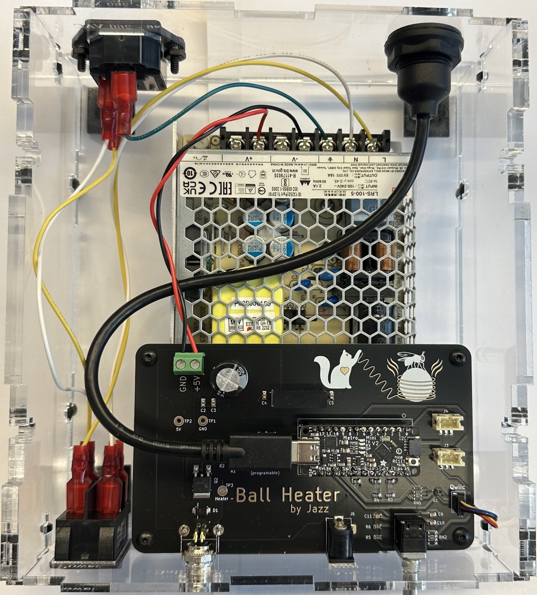
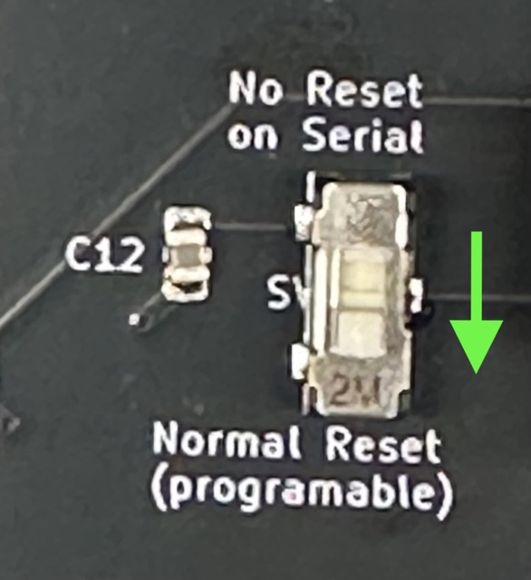
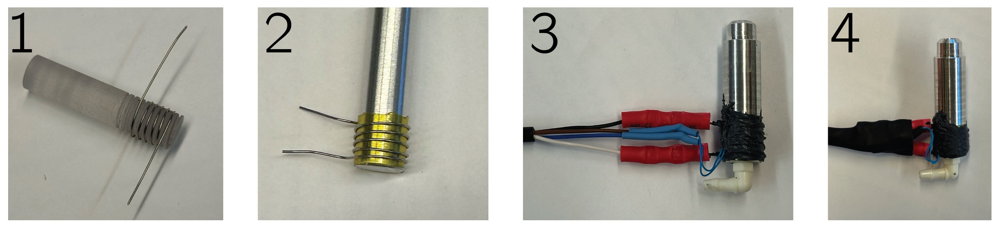

# Ball Heater Controller Assembly

The parts needed to build the ball heater are listed with links and part numbers in the first sheet of the [Bill of Materials (BOM)](../ball_heater_controller_pcb/ball_heater_controller_bom_V%201.ods) spreadsheet.

## PCB

PCBs can be ordered from one of many PCB supply houses, eg [pcbway](pcbway.com) or [jlcpcb](https://jlcpcb.com), using the [zipped gerber files](../ball_heater_controller_pcb/ball_heater_controller_v1.zip). Order a stencil as well to make the surface mount assembly easier and faster.

Once PCBs and parts have been acquired, apply solder paste using the stencil, and then use the [BOM printout](../ball_heater_controller_pcb/ball_heater_BOM_printout.pdf) to place surface mount parts in the correct locations matching their reference designators.  Then reflow the solder paste using a reflow over or hot air rework system. Lastly, solder the through hole components.

## Enclosure

Laser cut the two enclosure parts files out of 1/8 inch and 1/4 inch acrylic for [ball_heater_box_eighth](../ball_heater_controller_enclosure/tall_enclosure/ball_heater_box_eighth.ai) and [ball_heater_box_quarter](../ball_heater_controller_enclosure/tall_enclosure/ball_heater_box_quarter.ai), respectively. The case is assembled with 1/2 inch long #6-32 button head screws and nuts in the T-slots.

## Putting it all together

* Cut and prepare wires. Strip 1cm on all ends, and crimp 1/4 inch quick disconnect terminals as specified.

| Use |  Colors | Length | End Treatment|
|---|---|---| --- |
|Power in ground|green |5 inches | crimp one end|
|Power in to switch| yellow + white | 7 inches | crimp both ends|
|Switch to PSU| yellow + white | 10 inches | crimp one end|
|PSU to board| black + red | 4 inches | strip only|

* Attach wires to switch, power in on the bottom, power to PSU on the top, whith white on one  side and yellow on the other.
* Install switch into front panel.
* Attach USB panel mount cable to back panel.
* Attach IEC C14 power inlet to back panel with 6-32 by 5/8 flat head screws and nuts.
* Screw PSU to bottom of case with M3 x 8mm button head screws.
* Put rubber feet on bottom of case.
* Attach 4 in QWIIC cable to LCD.
* Screw LCD to front of case with #2-56 by 1/2 inch screws, nuts and washers, using acrylic spacer between LCD and front panel.
* Put the 4 walls and on case.
* Attach 4 1.5 inch 6-32 standoffs to board with 6-32 by 3/8 inch button head screws.
* Remove green O ring from the M8 connector on the PCB
* Attach board to case bottom with more  6-32 by 3/8 inch button head screws.
* Attach wires from switch to power inlet. Yellow to L and white to N.
* Attach green ground wire from power inlet to PSU ground terminal (⏚).
* Attach wires from switch to PSU. Yellow to L and white to N.
* Attach wires from PSU to board, red between V+ on PSU and +5V terminal on board, black from V- to GND on board. Trim stripped end slightly shorter before securing to board if bare wire shows outside the screw terminal.
* Make sure that the switch (SW2) to the left of the microcontroller is in the down position, towards "Normal Reset"

* Attach USB c cable to the microcontroller on the PCB.
* Screw box together with 6-32 by 1/2 inch button head screws and nuts.
* Loosen screws holding the PCB to the box, slide PCB till it is flush against the front panel, and re-tighten.
* Screw washer and nut onto rotary encoder and nut onto M8 connector on front of box.
* Put a 0.5 A fuse in the fuse holder of the power inlet.
* Put knob onto the rotary encoder.
* Program the microcontroller with the code from [`ball_heater_controller_firmware`](../ball_heater_controller_firmware/ball_heater_controller_firmware.ino) using the Arduino IDE, and test!

## Ball Heater

The ball heater itself is made by wrapping the bottom end of an aluminum ball holder in a layer of kapton tape for electrical insulation, and then a helix of nichrome wire for heating as well as a thermistor for temperature sensing.  All of this is secured and made a thermal unit using thermally conductive epoxy.

1. Start with 9.5 in of [nichrome wire](https://www.mcmaster.com/8880K77/) and wrap into a helix on a 3d printed [mandrel.](ball_heater_guide-01.stl)
2. Cover the bottom of the ball heater with 1 layer of [kapton tape](https://www.mcmaster.com/1754N12/), and then put the nichrome helix over it by gently unwinding it as it goes on. It should fit tight.  Make sure the coils are evenly spaced and none are touching or touching the aluminum.
3. Cover the Nichrome helix with [thermal epoxy](https://www.digikey.com/en/products/detail/mg-chemicals/8329TCM-6ML/6035511), and add a [thermistor](https://www.digikey.com/en/products/detail/epcos-tdk-electronics/B57863S0103F040/739899) just above the nichrome. It should be touching the aluminum, with the wires going down over the nichrome. Cover with thermal epoxy.

### Wiring

The heater is wired using a 4-pin M8 cable as follows :

|Wire Color | Attachment |
| --- | ----|
|Black | Nichrome heater|
|White | Nichrome heater|
|Blue | Thermistor|
|Brown | Thermistor|

* Trim black and white wires ~1 cm shorter than blue/brown, and use butt splice crimps to connect the nichrome wire to the black and white wires (it doesn't matter which one is on top).
* Strip Blue/brown wires and add heat shrink to each.
* Solder one to each lead of the thermistor, making sure that there is slack so that they will not get pulled on.
* Use heatshrink to insulate solder joints. It should look like (3) above.
* Add large heatshrink over all to neaten and strengthen connection (4).
